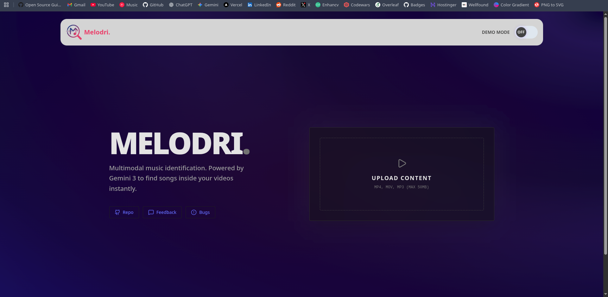
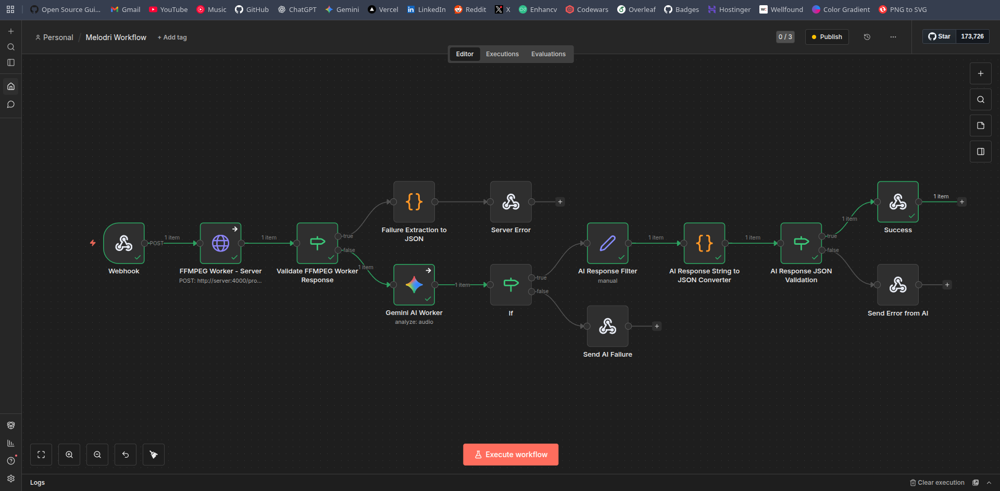

# Melodri — Multimodal Music Identification



---

## What is Melodri?

Melodri is a **multimodal music identification system** that detects songs embedded inside audio or video files.  
Instead of relying on fingerprint databases, Melodri trims a user-selected segment from the media, normalizes it, and uses **Gemini 3’s audio reasoning** to identify the track.

The system is designed as a **workflow-driven pipeline**, not a monolithic API, making it flexible, debuggable, and easy to extend.

Built for the Google AI Hackathon.

---

## What Makes It Different?

Most music identification tools:
- Only work with clean audio samples
- Fail with background music, speech, or video
- Depend entirely on fingerprint databases

Melodri differs by:
- Accepting both audio and video files
- Allowing user-selected timestamps
- Trimming and normalizing media using FFmpeg
- Using Gemini 3 for reasoning-based identification
- Orchestrating the pipeline through n8n workflows
- Returning structured, validated JSON responses
- Being fully containerized and open-source friendly

---

## Tech Stack

### Client
- React
- TypeScript
- Vite
- Tailwind CSS
- Custom hooks and modular components

### Server
- Node.js
- Express
- FFmpeg
- Multer (file uploads)
- file-type (MIME detection)
- spawn-based process execution
- TypeScript

### Workflow Engine
- n8n (self-hosted)
- Versioned workflow JSON
- Error-aware branching

### AI
- Google Gemini 3 (Audio Analysis)

### Infrastructure
- Docker
- Docker Compose
- pnpm

---

## Dependencies & Requirements

### Required
- Node.js 18+
- pnpm 8+
- Docker
- Docker Compose

### Optional
- FFmpeg (only if running server outside Docker)

---

## Installation Links

- Node.js: https://nodejs.org
- pnpm: https://pnpm.io/installation
- Docker: https://docs.docker.com/get-docker/
- Docker Compose: https://docs.docker.com/compose/
- FFmpeg: https://ffmpeg.org/download.html
- n8n Documentation: https://docs.n8n.io/

---

## Running Locally

### Clone the repository
```bash
git clone https://github.com/joyalgeorgekj/melodri.git
cd melodri
```

### Install client dependencies
```bash
cd app/client
pnpm install
```

### Install server dependencies
```bash
cd ../server
pnpm install
```

### Start server and n8n (Docker)
```bash
pnpm run docker:up
```

### Start the client
```bash
cd app/client
pnpm dev
```

### Default Services Link
- Client: http://localhost:5173
- n8n UI: http://localhost:5679
- Server: http://localhost:4000

---

## Workflow Explanation



1. Client uploads file and timestamp
2. n8n webhook receives request
3. n8n sends file to the server
4. Server validates file and timestamp
5. FFmpeg trims and converts media to WAV
6. Processed audio is returned to n8n
7. Gemini 3 analyzes the audio
8. AI response is validated and normalized
9. Final JSON response is returned to the client

---

## Best Practices Followed

- Clear separation of client, server, and workflow
- Strict file and timestamp validation
- spawn-based process execution (no shell injection)
- Automatic cleanup of temporary files
- Centralized async error handling
- Structured and consistent error responses
- No credentials committed to the repository
- Versioned workflows for reproducibility
- Containerized services for isolation

---

## Project Structure

```
app
├── client
│   ├── eslint.config.js
│   ├── index.html
│   ├── package.json
│   ├── pnpm-lock.yaml
│   ├── public
│   │   └── assets
│   │       └── image
│   │           └── logo.svg
│   ├── README.md
│   ├── src
│   │   ├── App.tsx
│   │   ├── components
│   │   │   ├── ActionButton.tsx
│   │   │   ├── Header.tsx
│   │   │   ├── MediaPreview.tsx
│   │   │   ├── ModeToggle.tsx
│   │   │   ├── ResultPanel.tsx
│   │   │   ├── SocialLinks.tsx
│   │   │   └── UploadCard.tsx
│   │   ├── hooks
│   │   │   ├── useMediaTimestamp.ts
│   │   │   └── useN8nRequest.ts
│   │   ├── index.css
│   │   ├── main.tsx
│   │   ├── types
│   │   │   └── result.ts
│   │   └── utils
│   │       ├── formatForFFmpeg.ts
│   │       └── platforms.ts
│   ├── tsconfig.app.json
│   ├── tsconfig.json
│   ├── tsconfig.node.json
│   └── vite.config.ts
├── n8n
│   └── workflows
│       └── Melodri-Workflow.json
└── server
    ├── Dockerfile
    ├── package.json
    ├── pnpm-lock.yaml
    ├── src
    │   ├── index.ts
    │   ├── middleware
    │   │   ├── errorHandle.ts
    │   │   └── fileUpload.ts
    │   └── utils
    │       ├── asyncHandler.ts
    │       ├── ffmpeg.ts
    │       ├── validateFile.ts
    │       └── validateTimestamp.ts
    └── tsconfig.json
```

---

## Server Error Response Structure

```json
{
  "ok": false,
  "code": "ERROR_CODE",
  "message": "Human readable error message"
}
```

---

Melodri is designed as a foundation, not a demo.  
The workflow-first architecture allows the system to evolve without rewriting the core.
